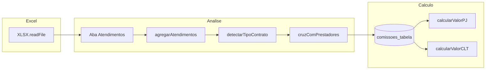

# Sistema de Faturamento — Domínio e arquitetura

Documentação de referência para manutenção de **cálculo PJ/prestador**, **planilhas**, **relatórios**, **cadastro**, **especialidades**, **fluxo financeiro** e **e-mail**. Complementa o kit genérico em [`.agent/ARCHITECTURE.md`](../.agent/ARCHITECTURE.md).

## Glossário

| Termo | Significado no código |
|--------|------------------------|
| **PJ / prestador** | Profissional **não CLT**; `tipo_colaborador` / vínculo `prestador`. O cálculo usa `calcularValorPJ`. |
| **CLT** | Regime CLT; período típico **26–25** (heurística nas datas da planilha). Usa `calcularValorCLT` e tabela `especialidades_clt`. |
| **Meta** | Valor de faturamento alvo (`meta_mensal` no vínculo e na comissão). Para PJ, compara-se `valor_clinica_total` (total faturado) com a meta. |
| **Fixo por turno** | Para certas especialidades PJ, o valor fixo do vínculo pode ser multiplicado pelo número de turnos (MANHÃ/TARDE) trabalhados na planilha. |

## Visão geral do fluxo (aba Atendimentos)

## Dois pipelines de planilha (não confundir)

| Pipeline | Entrada | Rota / ficheiro | Uso |
|----------|---------|-----------------|-----|
| **Atendimentos (principal)** | Ficheiro com aba **`Atendimentos`**, colunas mínimas `Data`, `Hora`, `Paciente` | `POST /api/atendimentos/analisar` — [`backend/routes/atendimentos.js`](../backend/routes/atendimentos.js) | Calcular pagamentos, preview, confirmar em `dados_mensais`. |
| **Upload mensal (legado)** | Abas nomeadas por mês, colunas A–T mapeadas | `POST /api/upload` + `POST /api/upload/confirmar` — [`backend/routes/upload.js`](../backend/routes/upload.js) | Resumo mensal; na confirmação, **`valor_bruto`** é calculado como em Calcular Pagamentos (`calcularFinanceiroUploadLinha`). Prestadores novos usam [`prestadorCadastroRapido.js`](../backend/services/prestadorCadastroRapido.js) (mesma regra que cadastro rápido em atendimentos). |

Alterações em regras de negócio do **primeiro** fluxo devem focar [`backend/services/calculoAtendimentos.js`](../backend/services/calculoAtendimentos.js) e o núcleo exportado em [`backend/services/calculoPJCore.js`](../backend/services/calculoPJCore.js).

## Cálculo de pagamento PJ (prestador)

**Motor:** [`backend/services/calculoAtendimentos.js`](../backend/services/calculoAtendimentos.js) (agregação, CLT, integração DB) e [`backend/services/calculoPJCore.js`](../backend/services/calculoPJCore.js) (função pura `calcularValorPJ`).

### Detecção CLT vs PJ

- **`detectarTipoContrato(datas)`:** analisa datas na coluna Data. Se o período abrange dois meses e o dia mínimo do mês mais antigo é ≥ 24 → **CLT**; se um único mês com dia mínimo ≥ 24 → **CLT**; caso contrário → **prestador (PJ)**.

### `processarAtendimentos`

1. Agrega linhas por profissional/unidade/turno (`agregarAtendimentos`).
2. Cruza com `prestador_vinculos` (`cruzComPrestadores`) conforme o tipo detectado.
3. Para cada item com vínculo **não CLT**, chama **`calcularValorPJ`** com comissão de `comissoes_tabela` (`buscarComissao` + `normalizarEspParaComissao`).
4. Especialidades com fixo por turno (`ESPECIALIDADES_COM_FIXO_PJ`): multiplica `valor_fixo_base` pelo número de turnos reais na planilha.

### `calcularValorPJ` (invariantes)

- Usa `valor_profissional_atend`, Part/OAB separado (`valor_prof_part_oab`), totais de clínica e **meta**.
- **Meta batida** e `pct_com_meta` > 0: deriva base “100%” a partir do VP sem Part/OAB e `pct_sem_meta`, depois aplica `pct_com_meta`.
- **Fora da meta:** total ≈ VP + fixo ajustado (desconto por falta sobre o fixo) + extras.
- Não alterar sem atualizar testes em [`backend/services/__tests__/calculoPJCore.test.js`](../backend/services/__tests__/calculoPJCore.test.js).

## API — Atendimentos e contratos (resumo)

Prefixo: **`/api/atendimentos`** (ver [`backend/server.js`](../backend/server.js)).

| Método | Caminho | Descrição |
|--------|---------|-----------|
| POST | `/analisar` | `multipart/form-data`: campo `planilha`; opcional `tipo_contrato_forcado` (`clt` \| `prestador`). |
| POST | `/recalcular` | JSON: `{ item }` — item completo do preview (faltas/extras, etc.). |
| POST | `/confirmar` | JSON: `calculados`, `mes`, `ano`, `tipo_contrato`, opcional `mapeamentos_novos`, `substituir`. |
| GET | `/prestadores` | Query `tipo_contrato` opcional. |
| POST | `/prestadores/cadastro-rapido` | Cadastro rápido pelo fluxo admin. |

### Resposta `POST /analisar` (campos principais)

- `sucesso`, `tipo_contrato`, `mes`, `ano`, `total_atendimentos`
- `calculados[]` — linhas calculadas (valores, meta, vínculo)
- `nao_reconhecidos[]` — nomes da planilha sem match
- `conflitos_clt[]` — quando a planilha é PJ mas o profissional tem vínculo/dados CLT no mesmo período
- `resumo` — contagens e `valor_total`

**Contratos Zod (fonte no frontend):** [`frontend-premium/src/schemas/atendimentos.ts`](../frontend-premium/src/schemas/atendimentos.ts).

### Corpo `POST /confirmar`

- `calculados` (array), `mes`, `ano`, `tipo_contrato` — obrigatórios
- `mapeamentos_novos`: `{ nome_planilha, prestador_id, vinculo_id? }[]`
- `substituir`: boolean — se `true`, apaga registos existentes do mesmo mês/ano/tipo antes de inserir

## Relatórios

| Prefixo | Rotas (exemplos) | Ficheiro |
|---------|------------------|----------|
| `/api/relatorios` | `GET /stats`, `GET /ranking/:mes/:ano`, `GET /evolucao/:prestadorId`, `GET /customizado` | [`backend/routes/relatorios.js`](../backend/routes/relatorios.js) |
| `/api/admin` | relatórios legados (notas, prestadores, performance, meses) | [`backend/routes/admin.js`](../backend/routes/admin.js) |
| `/api/dados-mensais` | `GET /relatorio-turnos/:ano`, resumos | [`backend/routes/dados-mensais.js`](../backend/routes/dados-mensais.js) |

**UI:** [`frontend-premium/src/pages/AdvancedReports.jsx`](../frontend-premium/src/pages/AdvancedReports.jsx), [`CustomReportModal.jsx`](../frontend-premium/src/components/CustomReportModal.jsx).

## Cadastro

| Fluxo | Rotas / ficheiros |
|-------|-------------------|
| Registo + confirmação com senha | [`backend/routes/auth.js`](../backend/routes/auth.js) |
| Enviar / confirmar por token | [`backend/routes/confirmacao.js`](../backend/routes/confirmacao.js), UI [`ConfirmRegistration.jsx`](../frontend-premium/src/pages/ConfirmRegistration.jsx) |
| Cadastro rápido (admin) | `POST /api/atendimentos/prestadores/cadastro-rapido` |
| Pré-cadastro na planilha mensal | [`backend/routes/upload.js`](../backend/routes/upload.js) |

## Especialidades e comissões

| Tipo | Tabela | API | UI |
|------|--------|-----|-----|
| PJ | `comissoes_tabela` | `/api/especialidades/pj` | [`EspecialidadesAdmin.jsx`](../frontend-premium/src/pages/EspecialidadesAdmin.jsx) |
| CLT | `especialidades_clt` | `/api/especialidades/clt` | idem |

Utilitários: [`backend/utils/especialidades.js`](../backend/utils/especialidades.js).

## Financeiro (UI e APIs)

O hub [`FinanceHub.jsx`](../frontend-premium/src/pages/FinanceHub.jsx) agrega upload, controlo de envios, pagamentos e notas. Dados vêm de `/api/upload`, `/api/dados-mensais`, `/api/pagamentos`, `/api/invoices`, `/api/comprovantes`.

## Envio de e-mail

**Serviço:** [`backend/services/emailService.js`](../backend/services/emailService.js) (Nodemailer). Configuração: primeiro **tabela `configuracoes`** (`email_host`, `email_port`, `email_user`, `email_pass`, …), fallback **`.env`**:

- `EMAIL_HOST`, `EMAIL_PORT`, `EMAIL_USER`, `EMAIL_PASS`, `EMAIL_SECURE`, `EMAIL_SERVICE`
- `FRONTEND_URL`, `EMPRESA_NOME`

**Gatilhos principais:** `auth.js` (cadastro), `confirmacao.js`, `pagamentos.js` (`/enviar-email/...`, `/enviar-email-massa/...`), `comprovantes.js`, `upload.js`, `settings.js` (`test-email` + `reloadConfig`), `schedulerService.js` (lembretes).

## Spec-Driven Development neste repositório

- **Contratos:** schemas Zod em `frontend-premium/src/schemas/` (TypeScript); parsing em [`frontend-premium/src/api/atendimentos.ts`](../frontend-premium/src/api/atendimentos.ts).
- **Harness:** MSW em desenvolvimento quando **`VITE_USE_MSW=true`** (ficheiro `.env` local no `frontend-premium`). Arranca o worker em [`frontend-premium/src/main.jsx`](../frontend-premium/src/main.jsx); handlers em [`frontend-premium/src/mocks/handlers.ts`](../frontend-premium/src/mocks/handlers.ts). Sem essa variável, o frontend fala com a API real (`VITE_API_URL` ou `http://localhost:5001/api`).
- **Testes frontend:** `npm run test` em `frontend-premium/` (Vitest — validação do fixture vs schema).
- **Testes do núcleo PJ:** na pasta `backend/`, `npm test` — `node:test` em [`backend/services/__tests__/calculoPJCore.test.js`](../backend/services/__tests__/calculoPJCore.test.js).

### Interoperabilidade futura (Python)

Se existir um serviço Python, espelhar os mesmos campos com **Pydantic** a partir desta documentação e dos schemas Zod; não há backend Python neste repositório.

## Ficheiros críticos (checklist antes de alterar)

1. [`backend/services/calculoPJCore.js`](../backend/services/calculoPJCore.js) — fórmula PJ pura.
2. [`backend/services/calculoAtendimentos.js`](../backend/services/calculoAtendimentos.js) — agregação, CLT, DB.
3. [`backend/routes/atendimentos.js`](../backend/routes/atendimentos.js) — contratos HTTP do fluxo da planilha.
4. [`frontend-premium/src/schemas/atendimentos.ts`](../frontend-premium/src/schemas/atendimentos.ts) — validação alinhada ao backend.
